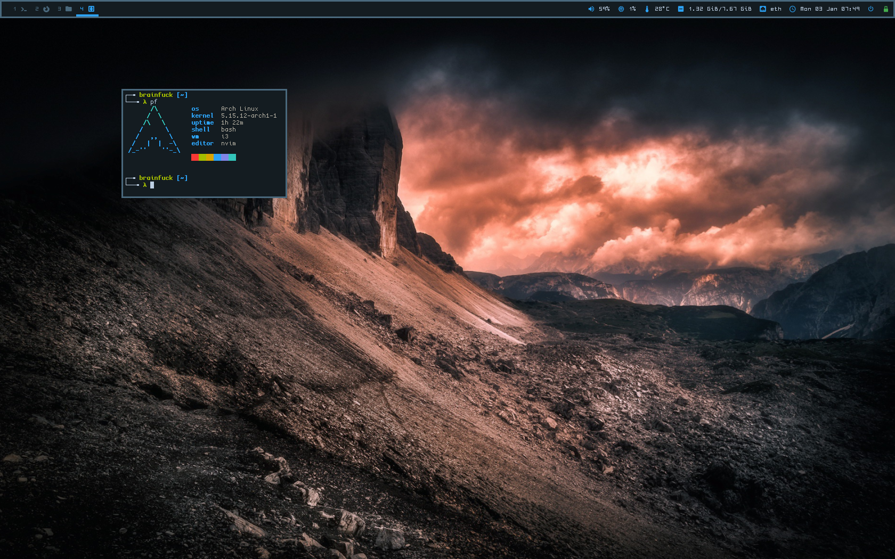
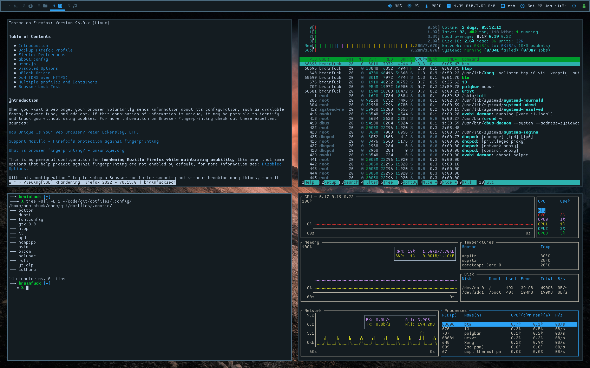
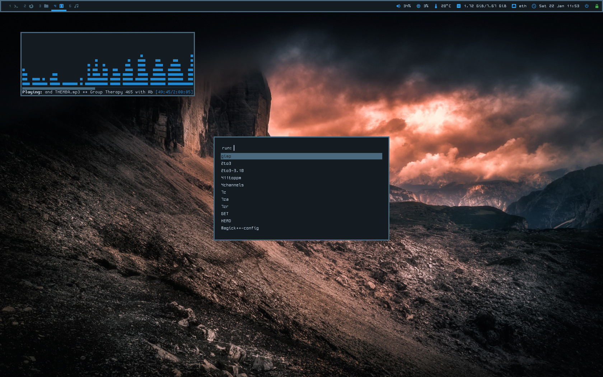
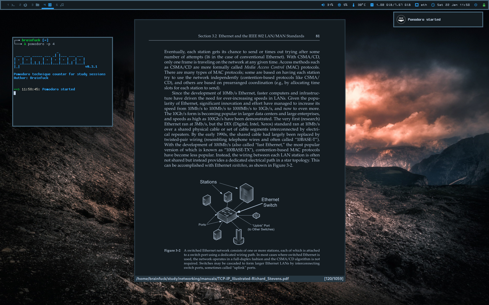

## My Arch Linux dotfiles









---

### Setup:

```
Window Manager      > i3-gaps
Bar                 > polybar
Program Launcher    > rofi
Compositor          > picom
Terminal Emulator   > urxvt
File Manager        > pcmanfm
Media Player        > ncmpcpp, vlc
Image Viewer        > feh
PDF Viewer          > zathura
Text Editor         > neovim
Browser             > firefox, w3m
Process Viewer      > htop, bottom
Fonts:              > cozette (Terminal), ohsnap (Bar)
```

**These dotfiles are modified according to my configuration, feel free to take what you need but don't install anything without checking first!**

**Thanks to [/r/unixporn](https://www.reddit.com/r/unixporn/) subreddit users for the examples and ideas, and to [Addy](https://addy-dclxvi.github.io/post/configuring-urxvt/) for the `.Xresources` color scheme**
