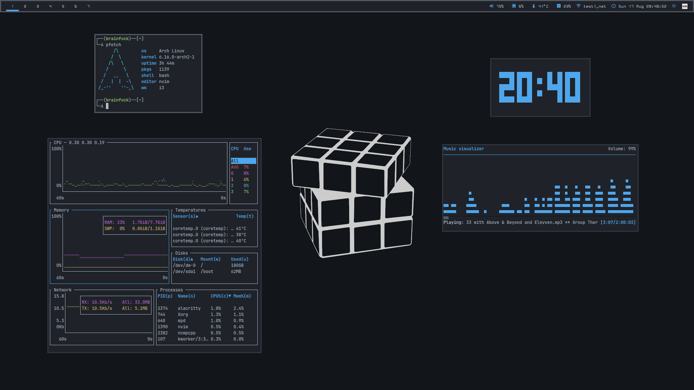

---

### Setup:

Component | Application
--- | ---
Shell | bash
Terminal Emulator | alacritty
Window Manager | i3-gaps ([i3-gaps-next-git](https://aur.archlinux.org/packages/i3-gaps-next-git/))
Bar | polybar
Program Launcher | rofi
Compositor | picom
File Manager | pcmanfm
Media Player | ncmpcpp, vlc
Image Viewer | feh
PDF Reader | zathura
Text Editor | neovim
Browser | firefox, w3m
RSS Reader | newsboat
Process Viewer | htop, bottom
Notification Daemon | dunst
Fonts | Terminal: [Cozette](https://github.com/slavfox/Cozette), Bar: [ohsnap](https://aur.archlinux.org/packages/ohsnap-otb/)
Color Scheme | [OneDark](https://github.com/navarasu/onedark.nvim)

These dotfiles are modified according to my configuration, feel free to take what you need but don't install anything without checking first!
