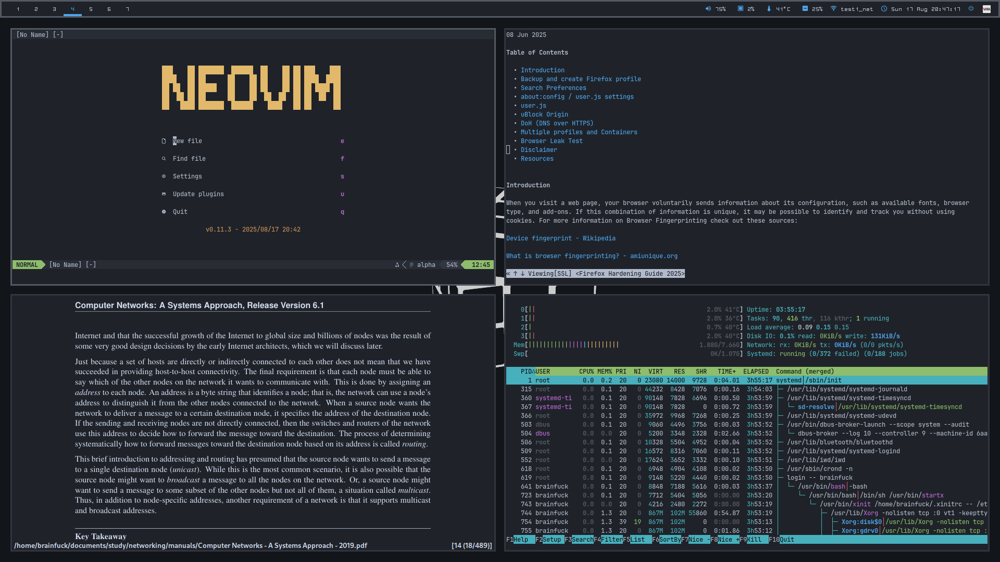

## My Arch Linux dotfiles

---

### Setup:

Component | Application
------------- | -------------
Window Manager | i3-gaps ([i3-gaps-next-git](https://aur.archlinux.org/packages/i3-gaps-next-git/))
Bar | polybar
Program Launcher | rofi
Compositor | picom
Terminal Emulator | urxvt ([rxvt-unicode-256xresources](https://aur.archlinux.org/packages/rxvt-unicode-256xresources/))
File Manager | pcmanfm
Media Player | ncmpcpp, vlc
Image Viewer | feh
PDF Viewer | zathura
Text Editor | neovim
Browser | firefox, w3m
Process Viewer | htop, bottom
Fonts | Terminal: [cozette](https://github.com/slavfox/Cozette), Bar: [ohsnap](https://aur.archlinux.org/packages/ohsnap-otb/)
Color Scheme | [Custom](https://github.com/brainfucksec/dotfiles/blob/master/.Xresources#L10)

These dotfiles are modified according to my configuration, feel free to take what you need but don't install anything without checking first!

Thanks to [/r/unixporn](https://www.reddit.com/r/unixporn/) subreddit users for the examples and ideas, and to [Addy](https://addy-dclxvi.github.io/post/configuring-urxvt/) for the `.Xresources` color scheme.
