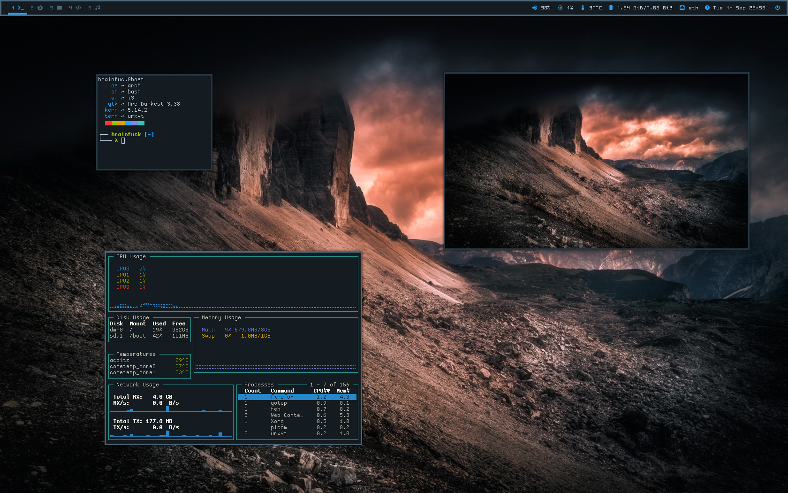

```
██████╗  ██████╗ ████████╗███████╗██╗██╗     ███████╗███████╗
██╔══██╗██╔═══██╗╚══██╔══╝██╔════╝██║██║     ██╔════╝██╔════╝
██║  ██║██║   ██║   ██║   █████╗  ██║██║     █████╗  ███████╗
██║  ██║██║   ██║   ██║   ██╔══╝  ██║██║     ██╔══╝  ╚════██║
██████╔╝╚██████╔╝   ██║   ██║     ██║███████╗███████╗███████║
╚═════╝  ╚═════╝    ╚═╝   ╚═╝     ╚═╝╚══════╝╚══════╝╚══════╝
```

## My Arch Linux dotfiles




### Setup
-----
```
Bar                     > polybar
Compositor              > picom
File Manager            > pcmanfm
Media Player            > ncmpcpp, vlc
Image Viewer            > feh
Program Launcher        > rofi
PDF Viewer              > zathura
Text Editor             > neovim
Terminal Emulator       > urxvt
Window Manager          > i3-gaps
Browser                 > firefox, w3m
Process Viewer          > htop, gotop
```

**These dotfiles are modified according to my configuration, feel free to take what you need but don't install anything without checking first!**

**Thanks to [/r/unixporn](https://www.reddit.com/r/unixporn/) subreddit users for the examples and ideas, and to [Addy](https://addy-dclxvi.github.io/post/configuring-urxvt/) for the `.Xresources` color scheme**
