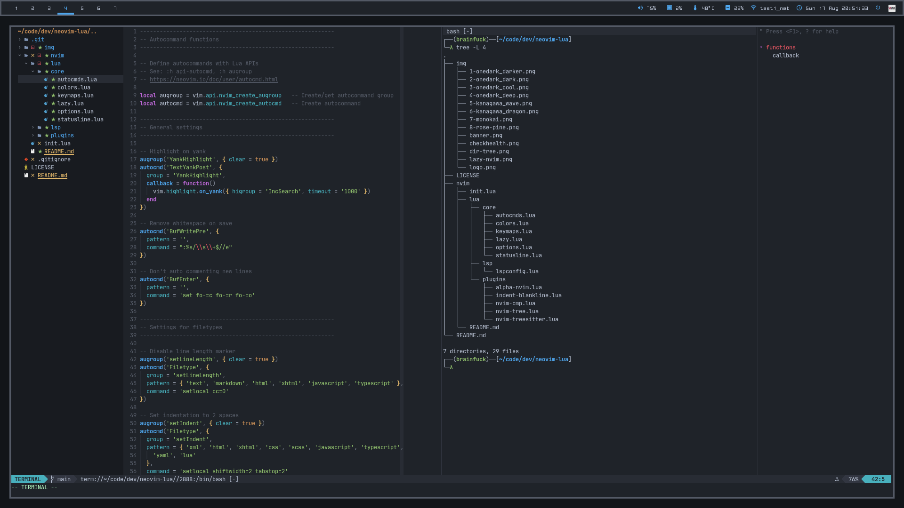
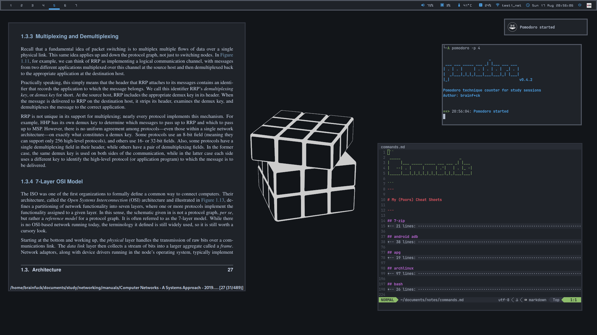

---

### Setup:

Component | Application
--- | ---
OS | Arch Linux
Shell | bash
Terminal Emulator | alacritty
Window Manager | i3-wm
Bar | polybar
Program Launcher | rofi
Compositor | picom
File Manager | pcmanfm
Media Player | ncmpcpp, vlc
Image Viewer | feh
PDF Reader | zathura
Text Editor | neovim
Browser | firefox, w3m
RSS Reader | newsboat
Process Viewer | htop, bottom
Notification Daemon | dunst
Fonts | Terminal: [JetBrainsMono Nerd Font](https://www.programmingfonts.org/#jetbrainsmono), Bar: [Ohsnap (ohsnapmod-otb)](https://codeberg.org/h3xx/ohsnapmod)
Color Scheme | [OneDark](.Xresources) from [OneDark.nvim](https://github.com/navarasu/onedark.nvim)

### Screenshots

<b>Click to expand</b>

---

**These are the dotfiles of my daily setup, you can get what you need but check before installing anything :)**

